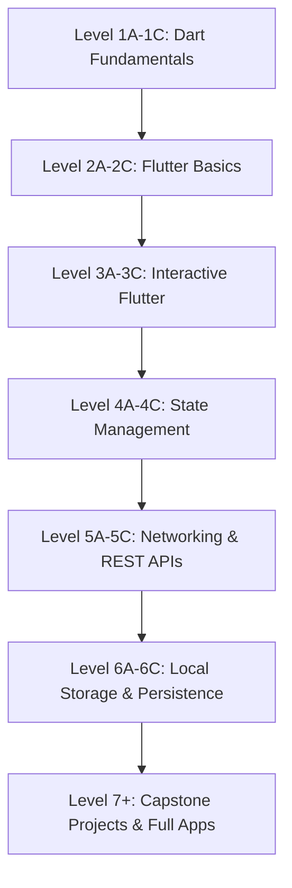
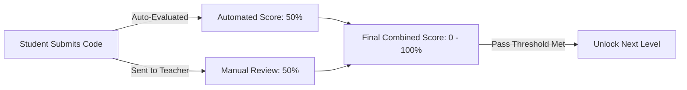

# 📘 Flutter Assessment & Training Portal: Teacher & Admin Master Guide

This document serves as the comprehensive, end-to-end operational manual for Teachers, Reviewers, and Administrators using the Flutter Assessment & Training Portal. It provides step-by-step instructions for managing curriculums, creating interactive coding problems, importing question banks in bulk, supervising exams, and conducting code reviews with automated and manual grading.

---

## 1. System Overview & Architecture

The Flutter Assessment & Training Portal is an advanced, Docker-isolated web platform designed to evaluate students across progressive stages of Dart and Flutter development.

### Key Architectural Highlights:
* **Dockerized Execution Engine (`flutter-runner`):** Every student code preview and test case execution runs inside an isolated Docker container with pre-warmed Flutter SDKs, web web-engine compilation, and Linux font bundles.
* **Multi-File Workspace Support:** Unlike simple single-file evaluators, this portal allows students and teachers to create multi-file project structures (e.g., `lib/main.dart`, `lib/models/item.dart`, `lib/widgets/card.jsx`). Code is stored and transferred as JSON file maps.
* **Real-Time Interactive Live Previews:** For UI and interactive Flutter challenges, the portal compiles Flutter Web bundles on the fly, rendering live interactive applications directly inside iframe viewports for both students and grading teachers.
* **Extended Proxy Timeouts (`300s`):** The Nginx proxy layer is configured with 5-minute timeouts to accommodate Flutter Web compilation without dropping connections.

### Roles & Responsibilities:
1. **Administrator (Role ID: 1):** Full access to user management, system-wide levels, global question banks, schedule creation, and system configurations.
2. **Teacher / Reviewer (Role ID: 2 / Staff):** Assigned to specific test schedules as Live Teacher (monitoring exams), Code Reviewer (evaluating Dart logic tests), or UI Reviewer (evaluating interactive Flutter apps).
3. **Student (Role ID: 3):** Access to assigned test schedules, live coding environments, and result tracking.

---

## 2. Level Creation & Progression Management

The portal follows a structured 7-stage curriculum progression. Students must clear earlier levels before advancing to complex state management and full-stack project builds.



### How to Create & Manage Levels:
1. Navigate to the Admin Dashboard and select **Levels Management** from the sidebar.
2. Click **+ Add New Level** or click **Edit** on an existing level card.
3. Configure the following critical parameters:
   * **Level Code:** Unique identifier matching the curriculum step (e.g., `1A`, `2B`, `3C`, `4A`).
   * **Assessment Type / Title:** Choose the domain:
     * *Dart Fundamentals* (No Flutter, Pure Dart, Console Output)
     * *Flutter Basics* (UI Construction, Widgets, No State/Networking)
     * *Interactive Flutter* (StatefulWidgets, Forms, Controllers, Navigation)
     * *State Management* (Provider, Riverpod, Shared State)
     * *Networking* (HTTP, REST APIs, JSON CRUD)
     * *Storage* (Shared Preferences, SQLite, File Handling)
     * *Projects* (E-Commerce, Hospital App, Banking App, etc.)
   * **Question Count:** Number of questions randomly or sequentially assigned to a student during an assessment (e.g., `3` or `5`).
   * **Duration (Minutes):** Total time allowed for the test session (e.g., `45`, `60`, or `120` minutes).
   * **Pass Threshold (%):** Minimum score required across all questions to unlock the next level (default: `70%` or `80%`).
4. Click **Save Level**. The level immediately becomes available for problem assignment and test scheduling.

---

## 3. Question Bank & Problem Management (In-Depth Guide)

The **Question Bank** (`AdminQuestions_new.jsx`) is the core engine where teachers design interactive coding challenges.

### Step-by-Step Problem Creation:
1. In the Admin Dashboard, click **Question Bank** -> **+ Create New Question**.
2. **Basic Metadata:**
   * **Title:** Enter a descriptive title (e.g., *"E-Commerce Login Form Validation"*).
   * **Level:** Select the target curriculum level from the dropdown (e.g., `Level 3A - Interactive Flutter`).
   * **Description:** Provide comprehensive instructions using Markdown formatting. Detail required widget names, expected behavior, and styling rules.

3. **Multi-File Workspace & Starter Code:**
   * In the **Starter Code & Files** section, you can define the scaffold provided to students when they start the test.
   * By default, `lib/main.dart` is selected. Enter the starter code (e.g., boilerplate `MaterialApp` and function signatures).
   * Click **+ Add File** to create supplementary files (e.g., `lib/models/product.dart` or `lib/utils/constants.dart`). This teaches students modular architecture!

4. **Resource Bundles (Images, Fonts, JSON Datasets):**
   * Go to the **Resources & Assets** tab.
   * Click **Upload Asset** to attach PNG/JPG images, custom TTF fonts, or sample JSON data files.
   * **How it works automatically:** When a student runs code, the Docker engine automatically copies all uploaded resource files into `assets/images/` or `assets/data/` inside their container workspace and auto-registers them in `pubspec.yaml`!
   * Students can reference images in their code simply via:
     ```dart
     Image.asset('assets/images/logo.png')
     ```

5. **Third-Party Packages Injection:**
   * In the **Required Packages** section, select checkboxes for third-party libraries needed by the problem:
     * `provider` / `flutter_riverpod` (State Management)
     * `http` / `dio` (Networking)
     * `shared_preferences` / `sqflite` (Storage)
     * `google_fonts`, `fl_chart`, `lucide_icons` (UI & Styling)
   * The container automatically injects these into `pubspec.yaml` during execution.

6. **Mock APIs & Backend Integration (Level 5+):**
   * For networking problems without requiring external internet access, use the built-in **Mock API Engine**.
   * **Mock API Route:** Specify the endpoint (e.g., `/api/mock/products` or `/api/mock/login`).
   * **Mock API Response (JSON):** Paste the exact JSON payload the container should return when the student's app makes an HTTP call to that route:
     ```json
     {
       "status": "success",
       "data": [
         {"id": 1, "name": "Wireless Headphones", "price": 99.99},
         {"id": 2, "name": "Smart Watch", "price": 199.50}
       ]
     }
     ```

7. **Mock Database Seeding (Level 6+):**
   * For storage and database problems, paste seed SQL queries or initial JSON states into the **Mock DB Seed** box to prepopulate local databases before student code runs.

8. **Custom Test Code & Automated Widget Verification:**
   * In the **Test Suite (Dart / Flutter Test)** box, write automated verification code using Flutter's `testWidgets` library.
   * Example test checking for a button tap and state change:
     ```dart
     import 'package:flutter_test/flutter_test.dart';
     import 'package:flutter/material.dart';
     import 'package:my_project/main.dart';

     void main() {
       testWidgets('Login button validates empty email', (WidgetTester tester) async {
         await tester.pumpWidget(const MyApp());
         await tester.tap(find.text('Login'));
         await tester.pump();
         expect(find.text('Email is required'), findsOneWidget);
       });
     }
     ```

---

## 4. Complete Bulk Upload Guide & Templates (CSV/XLSX)

The Flutter Assessment Portal supports instant bulk importing across four core administrative areas: **Students**, **Staff Members**, **Test Slot Registrations**, and the **Question Bank**. Template files (`.csv`) are included in the `bulk_templates/` folder of the repository.

### General Bulk Import Workflow:
1. Save your spreadsheet as a **UTF-8 Encoded CSV** (`.csv`) or Excel Spreadsheet (`.xlsx`).
2. Navigate to the target page in the Admin Sidebar and click **Bulk Import / Upload** -> **Choose File** -> **Upload**.
3. The system parses headers, validates fields, and automatically creates or registers the records.

---

### A. Student Bulk Import (`AdminUsers.jsx`)
Used to register dozens or hundreds of student accounts at once. New students created with role `STUDENT` start automatically unlocked at Level **1A**.
* **Template Path:** `bulk_templates/students_template.csv`

| Header Column | Required | Data Type | Description & Example Format |
| :--- | :--- | :--- | :--- |
| `email` | **YES** | String | Unique student email (e.g., `student1@bitsathy.ac.in`) |
| `full_name` | **YES** | String | Student's full name (e.g., `Aarav Sharma`) |
| `enrollment_no` | NO | String | University enrollment number (e.g., `737622CS101`) |
| `roll_no` | NO | String | Roll number / Register number (e.g., `22CS101`) |
| `role` | NO | String | Must be `STUDENT` (or defaults to `STUDENT` if blank) |
| `auth_provider` | NO | String | `GOOGLE` (for OAuth login) or `LOCAL` (password login). Defaults to `GOOGLE`. |
| `password` | **COND** | String | Required **only** if `auth_provider` is `LOCAL`. |

---

### B. Staff / Faculty Bulk Import (`AdminStaff.jsx`)
Used to onboard faculty members, live supervisors, and evaluators in bulk.
* **Template Path:** `bulk_templates/staff_template.csv`

| Header Column | Required | Data Type | Description & Example Format |
| :--- | :--- | :--- | :--- |
| `email` | **YES** | String | Faculty official email (e.g., `faculty1@bitsathy.ac.in`) |
| `full_name` | **YES** | String | Faculty full name (e.g., `Dr. Karthik S.`) |
| `staff_id` | NO | String | Staff ID / Employee Code (e.g., `BITFAC001`) |
| `role` | **YES** | String | Either `TEACHER` or `ADMIN` |
| `auth_provider` | NO | String | `GOOGLE` or `LOCAL`. Defaults to `GOOGLE`. |
| `password` | **COND** | String | Required **only** if `auth_provider` is `LOCAL`. |

---

### C. Test Slot Registration Bulk Import (`AdminTestSlots.jsx`)
Used inside any Test Schedule to assign/enroll a batch of students to that specific exam slot. The backend automatically searches existing student records (`role_id=1`) matching **any one** of the identifier columns below:
* **Template Path:** `bulk_templates/slot_registrations_template.csv`

| Header Column | Required | Matching Behavior & Example Format |
| :--- | :--- | :--- |
| `email` | **ANY 1** | Primary lookup by exact student email (e.g., `student1@bitsathy.ac.in`) |
| `enrollment_no` | **ANY 1** | Matches university enrollment number (e.g., `737622CS101`) |
| `roll_no` | **ANY 1** | Matches student roll number (e.g., `22CS101`) |
| `user_id` | **ANY 1** | Matches internal numeric User ID (e.g., `15`) |
| `full_name` | **ANY 1** | Fallback match by exact full name (if unique among students) |

---

### D. Question Bank Bulk Import (`AdminQuestions_new.jsx`)
Used to upload coding challenges, UI mockups, and starter packages in bulk.
* **Template Path:** `bulk_templates/question_bank_template.csv`

| Header Column | Required | Data Type | Description & Example Format |
| :--- | :--- | :--- | :--- |
| `level` | **YES** | String | Exact level code matching database (e.g., `1A`, `2B`, `3C`, `4A`). |
| `title` | **YES** | String | Question title (e.g., `Login Form Validation`). |
| `description` | **YES** | String | Detailed Markdown problem instructions & rules. |
| `starter_code` | **YES** | String / JSON | Single Dart string OR JSON object map for multi-file: `{"lib/main.dart":"import...","lib/item.dart":"class Item..."}` |
| `ui_required_widgets` | NO | JSON Array | List of required widget class names: `["Scaffold","AppBar","ListView","FloatingActionButton"]` |
| `required_packages` | NO | JSON Array | List of pubspec packages: `["provider","http","google_fonts"]` |
| `mock_api_route` | NO | String | Mock HTTP endpoint: `/api/mock/users` |
| `mock_api_response` | NO | JSON String | JSON payload returned by mock API: `{"users":[{"id":1,"name":"John"}]}` |
| `custom_test_code` | NO | String | Complete `testWidgets` Dart test suite code. |
| `is_active` | NO | Boolean | `true` or `1` to activate upon import. |

> [!IMPORTANT]
> **Handling Multi-Line Code in CSV:** When writing code or JSON maps inside spreadsheet cells (Excel/Numbers/Google Sheets), wrap the entire cell contents in double quotes `"` and press `Alt+Enter` (Windows) or `Option+Return` (Mac) for line breaks. Escape inner double quotes by doubling them (`""lib/main.dart""`).

---

## 5. Test Slot & Schedule Configuration

To administer an exam, teachers must schedule **Test Slots**.

1. Navigate to **Test Schedules / Slots** (`AdminTestSlots.jsx`) in the sidebar.
2. Click **+ Create Schedule**.
3. Configure Schedule Details:
   * **Schedule Name:** e.g., *"Batch 2026 - Level 3A Mid-Term Assessment"*.
   * **Start & End Date/Time:** Define the exact window during which students can log in and start the test.
   * **Duration (Minutes):** The timer limit for individual student sessions.
4. **Assigning Staff & Reviewers:**
   * **Live Teacher:** Responsible for monitoring active student sessions and addressing live queries.
   * **Code Reviewer Teacher:** Assigned to evaluate pure Dart logic submissions (`AdminSubmissions.jsx`).
   * **UI Reviewer Teacher:** Assigned to evaluate interactive Flutter UI submissions (`AdminManualGrading.jsx`).
5. Click **Create Slot**. Students registered to this slot will see it on their student dashboard as soon as the start time arrives.

---

## 6. Student Portal Rules & Execution Environment

When students log into the portal during an active test slot, they enter a strictly monitored, high-performance coding environment.

### The Student Coding Experience:
* **Monaco Code Editor:** Configured strictly in **Dark Theme** (`vs-dark`) for optimal readability, syntax highlighting, and code auto-completion.
* **Multi-File Explorer:** Students can navigate between `lib/main.dart` and supplementary code files created by the teacher.
* **Live Interactive Preview (Run Preview):**
  * When a student clicks **Run Preview**, the code is compiled inside their Docker container.
  * For Flutter UI questions, an interactive HTML5 viewport opens on the right half of the screen. Students can click buttons, type into text fields, scroll lists, and test animations in real-time!
* **Run Test Cases:** Students can run automated test cases to check their logic against hidden and visible teacher test assertions.
* **Submission Rules:**
  * Clicking **Submit** locks the code for that problem and records the final score.
  * The system automatically serializes multi-file code structures into secure database storage.
  * If a student gets disconnected or closes the tab, their session timer continues running server-side, but their code drafts are saved in browser storage and restored upon reconnection.

---

## 7. Grading & Result Analysis (With Excel Export)

Grading in the portal is a hybrid process combining **Automated AI/Test Assertions (50%)** and **Teacher Manual Review (50%)**.



### A. Coding Test Code Review (`AdminSubmissions.jsx`):
* Used for evaluating Level 1 Dart logic and algorithm challenges.
* **Searchable Filtering:** Use the search bar at the top to instantly search across **Student Name**, **Student Email**, **Roll Number**, **Problem Title**, or **Slot Name**.
* **Status Filter:** Filter by `ALL`, `PASS`, or `FAIL`.
* **Exporting Results to Excel (.XLSX):**
  * Click the green **Export XLSX** button in the filter bar.
  * Instantly downloads a formatted Excel spreadsheet containing: Submission ID, Student Name, Roll Number, Email, Test Slot, Problem ID, Status, Automated Score (%), Match Percent, Code Length, and Submission Timestamp!

### B. UI Test Code Review (`AdminManualGrading.jsx`):
* Used for evaluating Level 2 through Level 7 Flutter UI and full-stack interactive applications.
* **Searchable Filtering:** Use the new search input bar to instantly filter submissions by **Student Name**, **Roll Number**, **Email**, **Problem Title**, or **Slot Name**.
* **Interactive Live Preview Review:**
  * Select any student submission from the list.
  * In the review workspace, click the **Live Preview & Mockup** tab.
  * Teachers can actually interact with the student's submitted Flutter application live inside the iframe to verify UI animations, responsiveness, and button behaviors!
* **Inspecting Student Code:** Click the **Student Code** tab to explore all files submitted by the student (`lib/main.dart`, models, widgets).
* **Assigning Manual Grades & Feedback:**
  * Enter a **Manual Score (0 to 100)** in the grading box.
  * Write constructive feedback regarding clean code architecture, widget tree structure, and styling accuracy.
  * Click **Submit Manual Grade**. The system automatically computes the final score:
    $$\text{Final Score} = (\text{Automated Score} \times 0.5) + (\text{Manual Score} \times 0.5)$$
* **Exporting UI Results to Excel (.XLSX):**
  * Click the green **Export XLSX** button in the top filter bar.
  * Instantly downloads an Excel spreadsheet containing: S.No, Submission ID, Student Name, Email, Roll Number, Test Slot, Problem Title, Auto Score (50%), Manual Score (50%), Final Combined Score (%), Teacher Feedback, Status, and Code Files Count!

---

## 8. Troubleshooting & Best Practices

1. **Nginx 504 Gateway Timeout during Preview:**
   * *Cause:* First-time Docker container builds for complex Flutter Web apps can take 40-50 seconds.
   * *Solution:* The system is configured with a 300-second Nginx timeout. Advise students to wait patiently during their first preview click; subsequent builds use Docker layer caching and render in 1-2 seconds.
2. **Database Column Errors on Submit (`ER_BAD_FIELD_ERROR`):**
   * *Cause:* Submitting raw JavaScript object maps to MySQL text columns.
   * *Solution:* The portal backend automatically serializes all multi-file maps via `JSON.stringify(code)` before storing and cleanly parses them back upon loading.
3. **Missing Assets in Preview:**
   * Ensure images uploaded in Question Bank are referenced exactly as `assets/images/<filename>` in Dart code. The runner auto-links them in `pubspec.yaml`.

---
*Generated by Antigravity AI — Flutter Assessment & Training Portal*
